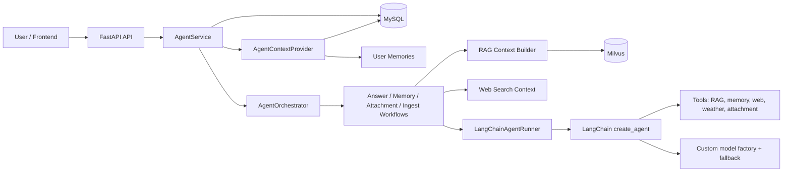

# CookingAgent

> A Chinese cooking assistant powered by LangChain Agent, RAG, long-term memory, tools, and a full-stack chat workspace.

[](https://fastapi.tiangolo.com/)
[](https://react.dev/)
[](https://www.typescriptlang.org/)
[](https://www.langchain.com/)
[](https://milvus.io/)
[](LICENSE)

CookingAgent 是一个面向做菜场景的中文 AI Agent 应用。它把菜谱知识库、LangChain Tool Calling、多轮会话、用户长期记忆、附件解析、语音转写、联网搜索和天气查询整合到同一个聊天工作台中。

知识库数据主要来自 [程序员做饭指南 / HowToCook](https://github.com/Anduin2017/HowToCook)。

## Table of Contents

- [Features](#features)
- [Documentation](#documentation)
- [Architecture](#architecture)
- [Tech Stack](#tech-stack)
- [Project Structure](#project-structure)
- [Quick Start](#quick-start)
- [Configuration](#configuration)
- [RAG Knowledge Base](#rag-knowledge-base)
- [API Overview](#api-overview)
- [Testing](#testing)
- [Development Notes](#development-notes)
- [Roadmap](#roadmap)
- [License](#license)

## Features

| Capability | Description |
| --- | --- |
| LangChain Agent | Uses `langchain.agents.create_agent` with tool calling and streaming responses. |
| Model fallback | Keeps project-owned model selection and fallback order for Kimi, Xiaomi, AIHubMix, OpenAI-compatible, and local OpenAI-compatible services. |
| RAG retrieval | Indexes local cooking Markdown documents into Milvus and retrieves relevant recipe chunks before answering. |
| Query rewriting | Uses a LangChain Runnable chain to rewrite conversational questions into retrieval-friendly standalone queries. |
| Long-term memory | Extracts user preferences with LangChain structured output, stores them in MySQL, injects them into prompts, and exposes a `search_user_memory` tool. |
| Conversation context | Combines recent messages, rolling summaries, user memories, RAG context, web context, and attachment context for each turn. |
| Web and weather tools | Uses SerpApi for web search and QWeather for weather-aware cooking suggestions. |
| Attachments and voice | Supports file upload, attachment parsing, document ingestion, and local speech-to-text fallback. |
| Persistence | Stores users, conversations, messages, attachments, parse results, memories, summaries, and agent run snapshots. |
| Frontend workspace | React + TypeScript chat UI with conversation history, message streaming, attachments, voice input, and settings. |

## Documentation

- [Requirements analysis](docs/requirements-analysis.md)
- [Architecture design](docs/architecture-design.md)

## Architecture



Normal answer flow:

1. The frontend sends a user message to the backend stream endpoint.
2. The backend persists the user message and creates an `AgentRun`.
3. `AgentContextProvider` loads recent messages, rolling summary, and long-term user memories.
4. `AnswerWorkflow` builds RAG and web-search context when needed.
5. `LangChainAgentRunner` creates a LangChain agent with project tools and the custom model factory.
6. The assistant response is streamed to the frontend and persisted with run metadata.
7. Conversation summary and long-term memory are updated as non-critical side effects.

## Tech Stack

| Layer | Technologies |
| --- | --- |
| Frontend | React 18, TypeScript, Vite, React Markdown |
| Backend | FastAPI, SQLAlchemy, Alembic, Pydantic, PyMySQL |
| Agent | LangChain 1.x, LangChain Core, LangChain OpenAI adapter, Tool Calling |
| RAG and parsing | MinerU, Milvus, pymilvus, sentence-transformers, FlagEmbedding |
| Memory | MySQL `memory_items`, LangChain structured output, prompt injection, memory search tool |
| Voice | faster-whisper local transcription |
| Cache | Optional Redis |
| Evaluation | RAGAS evaluation scripts and tests |

## Project Structure

```text
CookingAgent/
├─ backend/
│  ├─ agent/
│  │  ├─ factories/          # Model and tool factories
│  │  ├─ memory/             # LangChain message/context providers
│  │  ├─ orchestration/      # Intent routing and workflow dispatch
│  │  ├─ prompts/            # System and RAG prompts
│  │  ├─ rag/                # RAG policy, query rewrite, context builder
│  │  ├─ tools/              # LangChain tools
│  │  ├─ workflows/          # Answer, memory, attachment, document workflows
│  │  └─ runner.py           # LangChain agent runtime wrapper
│  ├─ src/
│  │  ├─ api/                # FastAPI routers and dependencies
│  │  ├─ core/               # Settings, logging, security, exceptions
│  │  ├─ db/                 # SQLAlchemy session and models
│  │  ├─ rag/                # Embedding, rerank, Milvus repository
│  │  ├─ repositories/       # Data access layer
│  │  ├─ services/           # Business services
│  │  └─ tests/              # Backend tests
│  ├─ scripts/               # Indexing and evaluation scripts
│  └─ requirements.txt
├─ frontend/
│  ├─ src/components/        # Auth and chat UI components
│  ├─ src/hooks/             # Auth and workspace state
│  ├─ src/services/          # API clients
│  └─ package.json
├─ data/                     # Local cooking Markdown data
├─ models/                   # Local embedding, rerank, and voice models
└─ README.md
```

## Quick Start

### Prerequisites

- Python 3.12 recommended
- Conda environment named `cook-agent`
- Node.js 18+
- MySQL 8+
- Milvus 2.4+
- Redis optional

### 1. Install backend dependencies

```powershell
conda activate cook-agent
cd backend
python -m pip install -r requirements.txt
```

### 2. Install frontend dependencies

```powershell
cd frontend
npm install
```

### 3. Create `.env`

Copy the example environment file and fill in your local secrets:

```powershell
Copy-Item example.env .env
```

### 4. Start backend

```powershell
conda activate cook-agent
cd backend
uvicorn main:app --reload
```

Useful URLs:

- Health check: <http://127.0.0.1:8000/health>
- OpenAPI docs: <http://127.0.0.1:8000/docs>

### 5. Start frontend

```powershell
cd frontend
npm run dev
```

The frontend dev server proxies API requests to `http://127.0.0.1:8000` by default. Use `VITE_BACKEND_URL` if you need a different backend URL.

## Configuration

All supported environment variables are documented in [example.env](example.env). The most important groups are:

| Group | Variables |
| --- | --- |
| App and database | `APP_SECRET_KEY`, `AUTO_CREATE_TABLES`, `MYSQL_*` |
| Agent model | `AGENT_MODEL_PROVIDER`, `AGENT_MODEL_FALLBACK_ORDER`, `KIMI_*`, `AIHUBMIX_*`, `LOCAL_MODEL_*` |
| RAG and Milvus | `MILVUS_*`, `RAG_*` |
| Document parsing | `MINERU_*` |
| External tools | `SERPAPI_API_KEY`, `WEATHER_API_KEY` |
| Voice and cache | `VOICE_*`, `REDIS_*` |

## RAG Knowledge Base

Index local recipe data into Milvus:

```powershell
conda activate cook-agent
cd backend
python scripts/index_data_to_milvus.py --data-dir ..\data --knowledge-base-id cookbook --rebuild
```

Notes:

- The local indexer supports `.md`, `.markdown`, `.txt`, `.json`, `.jsonl`, and `.csv`.
- Multi-format sample recipe files are available under `data/recipes_multi_format`.
- Use `--rebuild` only when you want to drop and recreate the configured Milvus collection.
- Changing `RAG_EMBEDDING_MODEL_PATH` or vector dimension requires rebuilding the collection.
- The current long-term user memory feature does not use the vector database; it reads from MySQL and is injected into the LangChain agent context.

## API Overview

| Area | Endpoint |
| --- | --- |
| Auth | `/api/v1/auth/*` |
| Conversations | `/api/v1/conversations` |
| Messages | `/api/v1/conversations/{conversation_id}/messages` |
| Agent chat | `/api/v1/agent/chat/stream` |
| Attachments | `/api/v1/conversations/{conversation_id}/attachments` |
| Voice transcription | `/api/v1/voice/transcriptions` |

OpenAPI documentation is available at `/docs` when the backend is running.

## Testing

Run backend tests:

```powershell
conda activate cook-agent
python -m pytest backend/src/tests
```

Run frontend build:

```powershell
cd frontend
npm run build
```

Current verified backend status:

```text
63 passed
```

## Development Notes

- Keep model creation inside `backend/agent/factories/model_factory.py`; LangChain should use the project-owned model factory and fallback candidates.
- `AUTO_CREATE_TABLES=true` is convenient for local development. Use migrations for production deployments.
- `memory_items` and `conversation_summaries` must exist before enabling long-term memory and rolling summaries in production.
- SerpApi and QWeather are optional. If their keys are missing, the corresponding tools degrade gracefully.
- Do not commit `.env`, API keys, database passwords, SMTP passwords, local model files, or generated evaluation artifacts.

## Roadmap

- [ ] Add production-grade Alembic migrations for all current tables.
- [ ] Add optional vector retrieval for long-term user memory.
- [ ] Add CI badges after GitHub Actions are configured.
- [ ] Add screenshots or a short demo GIF for the chat workspace.
- [ ] Add deployment examples for Docker Compose and cloud environments.

## License

This project is licensed under the [Apache License 2.0](LICENSE).
