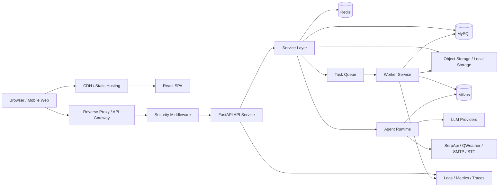
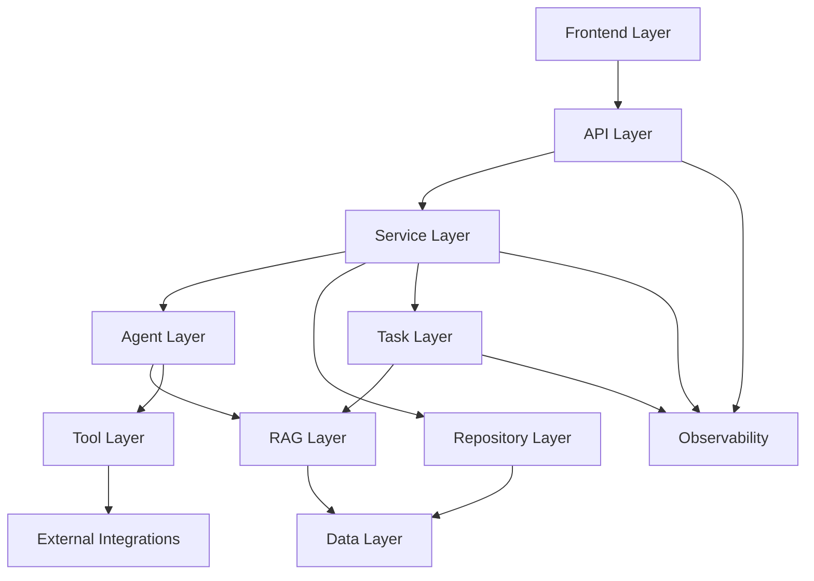
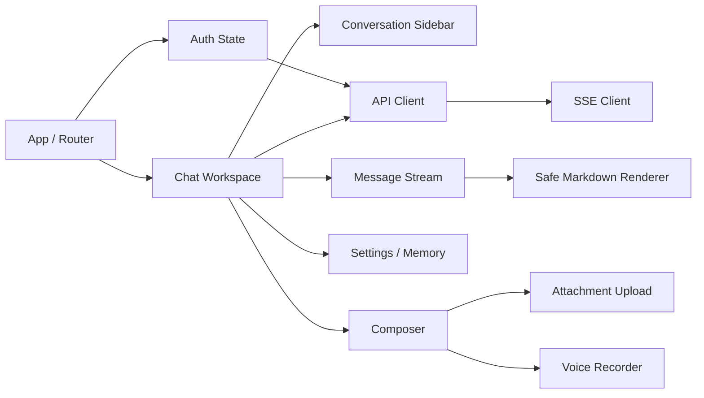
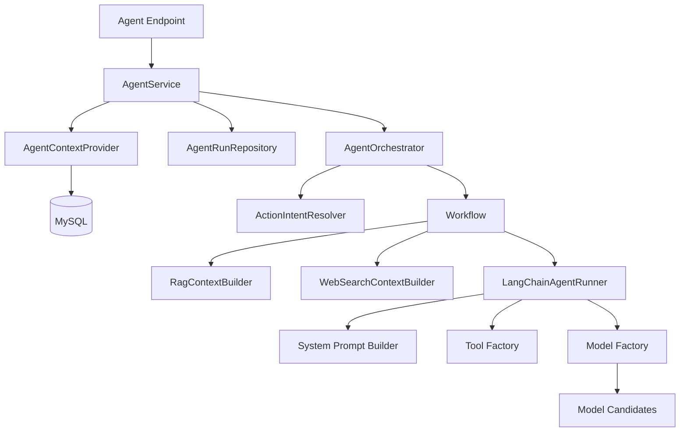
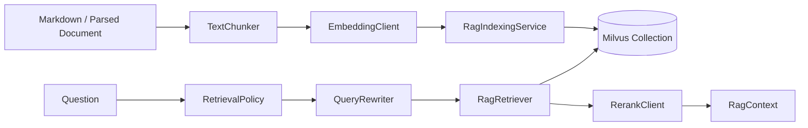
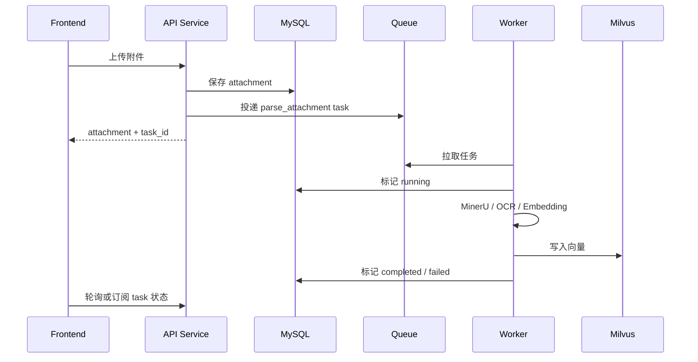
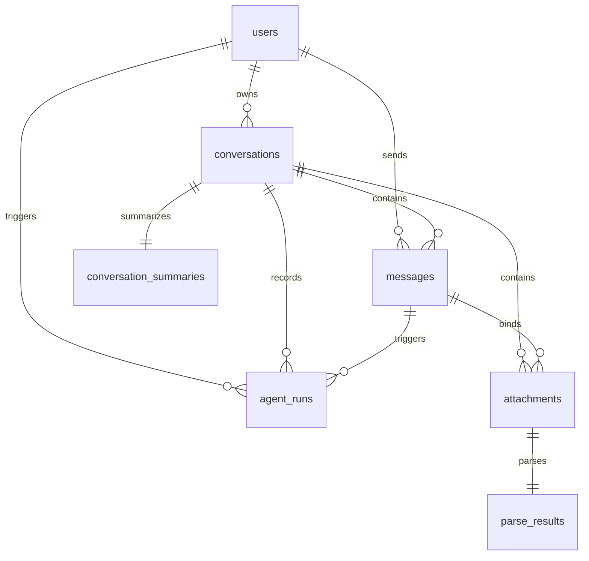
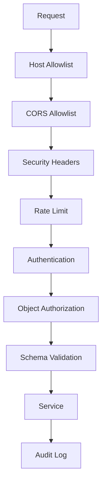
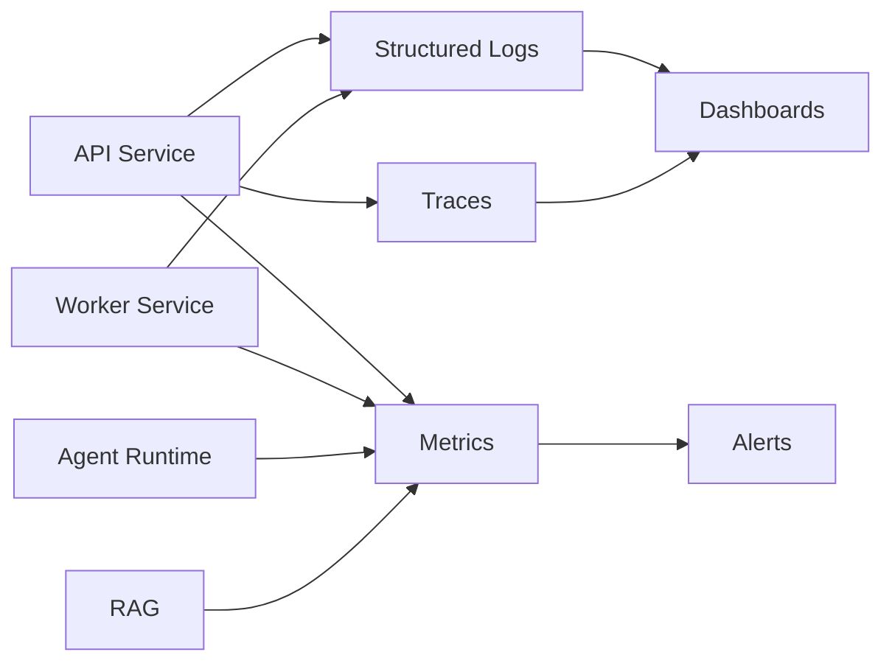
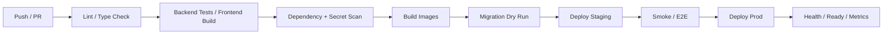

# CookingAgent 生产级架构设计文档

更新日期：2026-05-24

## 1. 文档定位

本文档基于 [requirements-analysis.md](requirements-analysis.md) 的生产级需求，定义 CookingAgent 的目标架构、模块边界、部署拓扑、运行链路、安全边界、性能策略、数据治理、可观测性和迭代路线。

本文档同时区分：

- **当前架构**：仓库中已经实现或已有基础的 FastAPI、React、LangChain、RAG、Redis、MySQL、Milvus 能力。
- **生产目标架构**：为了真实部署、长期维护和承载用户流量，需要补齐的网关、安全、迁移、任务队列、对象存储、监控、告警、备份和 CI/CD 能力。

## 2. 架构目标

CookingAgent 采用前后端分离、后端分层、Agent 工作流编排、RAG 独立基础设施、外部依赖可降级的架构。

生产级架构目标：

- **稳定**：模型、RAG、语音、搜索、天气、解析任务失败时可降级，核心会话数据不丢。
- **高效**：普通 API 走缓存和分页，Agent 首 token 尽快返回，解析/OCR/embedding 等长耗时任务异步化。
- **安全**：认证、对象级授权、上传、CORS、Host、响应头、日志脱敏、密钥管理和供应链扫描成为部署基线。
- **体验可恢复**：前端能表达发送中、生成中、解析中、失败、重试、引用来源等状态。
- **可运维**：容器化、数据库迁移、健康检查、结构化日志、指标、告警、备份、发布回滚完整闭环。
- **可演进**：新模型、新工具、新知识库、新任务类型可以在既有模块边界内扩展。

## 3. 总体拓扑



生产部署建议拆成四类进程：

| 进程 | 职责 | 伸缩方式 |
| --- | --- | --- |
| Frontend static | React 构建产物、静态资源、缓存策略 | CDN 或静态服务器横向扩展 |
| API service | HTTP API、SSE、认证、会话、轻量业务事务 | 多副本，按 CPU、QPS、SSE 连接数扩展 |
| Worker service | 附件解析、OCR、embedding、批量索引、清理任务 | 按队列长度和任务耗时扩展 |
| Scheduler service | 定时清理、备份检查、评估任务、索引重建触发 | 单副本或 leader election |

## 4. 当前代码模块与生产目标模块

### 4.1 当前代码模块

```text
backend/
├─ main.py                         # FastAPI 应用入口
├─ src/
│  ├─ api/                          # 路由、依赖、版本化接口
│  ├─ cache/                        # Redis 客户端、缓存服务、限流器
│  ├─ core/                         # 配置、安全、日志、常量、异常
│  ├─ db/                           # SQLAlchemy Base、session、ORM models
│  ├─ rag/                          # 分块、embedding、rerank、Milvus、检索器、索引服务
│  ├─ repositories/                 # 数据访问对象
│  ├─ schemas/                      # Pydantic 请求/响应模型
│  ├─ services/                     # 认证、会话、消息、文件、语音、Agent 等业务服务
│  └─ tests/                        # 后端测试
└─ agent/
   ├─ contracts.py                  # Service 与 Agent 之间的数据契约
   ├─ runner.py                     # LangChain Agent runtime 包装
   ├─ factories/                    # 模型工厂、工具工厂
   ├─ fallback/                     # 本地兜底回复
   ├─ memory/                       # 历史消息和上下文提供器
   ├─ orchestration/                # 意图识别与 workflow 分发
   ├─ output/                       # LangChain 输出归一化
   ├─ prompts/                      # 系统提示词和 RAG 渲染
   ├─ rag/                          # Agent 侧 RAG 策略、查询改写、上下文构建
   ├─ tools/                        # LangChain 工具
   ├─ web/                          # RAG miss 后的联网搜索上下文
   └─ workflows/                    # answer、attachment_parse、document_ingest、memory_update
```

### 4.2 生产新增模块

| 模块 | 建议位置 | 目标 |
| --- | --- | --- |
| 安全中间件 | `backend/src/core/middleware.py` | Request ID、Host allowlist、CORS、安全响应头、日志脱敏 |
| 就绪检查 | `backend/src/api/v1/endpoints/health.py` | `/health` 存活检查和 `/ready` 依赖检查分离 |
| 数据库迁移 | `backend/alembic/` | 生产环境用 Alembic 管理 schema，不再自动改表 |
| 异步任务 | `backend/src/tasks/` | 解析、OCR、embedding、索引、清理、评估等任务 |
| 任务 API | `backend/src/api/v1/endpoints/tasks.py` | 查询异步任务状态、失败原因和重试入口 |
| 记忆管理 API | `backend/src/api/v1/endpoints/memories.py` | 用户查看、编辑、删除、关闭长期记忆 |
| 配额与用量 | `backend/src/services/usage_service.py` | token、模型、工具、语音、解析用量统计 |
| 审计日志 | `backend/src/services/audit_service.py` | 登录、越权、删除、密钥操作、安全事件记录 |
| 对象存储适配 | `backend/src/storage/` | 本地、S3/OSS/COS 等存储后端统一接口 |
| 监控导出 | `backend/src/observability/` | 指标、trace、结构化日志上下文 |
| 部署文件 | `Dockerfile`、`docker-compose.yml`、`deploy/` | 本地、staging、production 的可复现部署 |

## 5. 分层架构



| 层 | 当前职责 | 生产职责补充 |
| --- | --- | --- |
| Frontend | 登录、会话、消息、附件、语音、设置基础 UI | 流式状态恢复、引用展示、移动端体验、可访问性、错误重试、token 策略 |
| API | FastAPI 路由、依赖、schema、SSE | 全局中间件、CORS/Host/安全头、请求 ID、分页协议、ready check |
| Service | 业务事务、缓存失效、Agent 回合编排 | 幂等、配额、审计、数据删除、用量统计、任务投递 |
| Agent | 意图、工作流、LangChain runtime、工具、提示词 | 提示注入防护、工具策略、模型成本记录、提示词版本管理 |
| RAG | 分块、embedding、Milvus、rerank、检索 | collection 版本、索引任务、评估闭环、检索指标 |
| Repository | SQLAlchemy 查询封装 | 对象级授权辅助、分页、软删除过滤、审计字段 |
| Task | 当前主要同步执行解析/入库 | Worker、队列、重试、超时、任务状态、死信处理 |
| Data | MySQL、Redis、Milvus、本地文件 | 迁移、备份、对象存储、保留期、恢复演练 |
| Observability | 日志基础能力 | 结构化日志、指标、trace、告警、仪表盘 |

## 6. 前端架构

前端继续采用 React + TypeScript + Vite。生产化重点是把聊天工作台做成状态明确、错误可恢复、移动端可用的实际产品界面。



前端模块职责：

| 模块 | 职责 | 生产要求 |
| --- | --- | --- |
| Auth state | 登录态、token、当前用户 | 避免长期 token 持久化；401 统一处理；退出清理状态 |
| API client | REST、上传、SSE 封装 | 统一错误码、超时、重试边界、请求 ID 透传 |
| Chat workspace | 会话、消息、Agent 流 | 状态机清晰：idle、sending、streaming、failed、retryable |
| Message renderer | Markdown 与引用展示 | 禁止未清洗 HTML；区分本地知识库引用和联网来源 |
| Upload manager | 附件上传、删除、解析状态 | 进度、失败、重试、大小和类型提示 |
| Voice manager | 录音、上传、转写 | 时长限制、转写状态、可编辑文本 |
| Memory settings | 长期记忆查看与删除 | 删除确认、隐私说明、关闭记忆入口 |

前端与后端的契约：

- 所有业务请求携带认证信息。
- 所有状态变更失败要保留用户输入，给出重试入口。
- SSE 事件至少处理 `user_message`、`agent_run`、`delta`、`done`、`error`。
- 附件和语音任务展示明确状态，不用“无响应”代替等待。

## 7. 后端 API 架构

### 7.1 路由组织

当前路由继续保留：

| 能力 | 路由 |
| --- | --- |
| 认证 | `/api/v1/auth/*` |
| 会话 | `/api/v1/conversations` |
| 消息 | `/api/v1/conversations/{conversation_id}/messages` |
| 附件 | `/api/v1/conversations/{conversation_id}/attachments`、`/api/v1/attachments/{attachment_id}` |
| 语音 | `/api/v1/voice/transcriptions` |
| Agent | `/api/v1/agent/chat/stream` |
| 存活检查 | `/health` |

生产新增路由：

| 能力 | 路由 | 说明 |
| --- | --- | --- |
| 就绪检查 | `/ready` | 检查 MySQL、Redis、Milvus、关键配置 |
| 会话管理 | `PATCH/DELETE /api/v1/conversations/{conversation_id}` | 重命名、归档、删除 |
| 记忆管理 | `/api/v1/memories` | 查看、编辑、删除长期记忆 |
| 解析结果 | `/api/v1/attachments/{attachment_id}/parse-result` | 查询解析状态和结果摘要 |
| 任务状态 | `/api/v1/tasks/{task_id}` | 查询异步任务、失败原因、重试条件 |
| 用量统计 | `/api/v1/usage` | 用户级 token、工具、语音、解析用量 |

### 7.2 中间件顺序

生产 API 服务建议中间件顺序：

1. Request ID 注入。
2. Trusted Host 校验。
3. CORS allowlist。
4. 安全响应头。
5. 请求体大小限制。
6. 结构化访问日志。
7. 异常处理。
8. 路由依赖认证和授权。

### 7.3 响应协议

所有 JSON API 使用稳定结构：

```json
{
  "message": "操作成功。",
  "data": {}
}
```

错误响应使用稳定错误码：

```json
{
  "code": "CONVERSATION_NOT_FOUND",
  "message": "会话不存在。",
  "detail": {}
}
```

SSE 事件协议：

| 事件 | 用途 |
| --- | --- |
| `user_message` | 用户消息已持久化 |
| `agent_run` | Agent run 已创建 |
| `delta` | 模型增量文本 |
| `done` | 助手消息和运行记录已完成 |
| `error` | 可恢复或不可恢复错误 |
| `task` | 可选，用于附件解析或入库任务状态 |

## 8. Agent 架构



### 8.1 工作流边界

| Workflow | 当前职责 | 生产增强 |
| --- | --- | --- |
| `AnswerWorkflow` | 普通问答、RAG/Web 上下文、LangChain 运行 | 成本记录、引用归一化、提示注入策略、工具调用审计 |
| `AttachmentParseWorkflow` | 解析附件并返回结果 | 改为投递异步任务，返回 task_id 和状态 |
| `DocumentIngestWorkflow` | 解析文档并写入 Milvus | 支持任务重试、索引版本、失败恢复、进度查询 |
| `MemoryUpdateWorkflow` | 抽取和更新长期记忆 | 用户可见管理、删除后不注入、敏感信息过滤 |

### 8.2 模型 fallback

生产模型调用策略：

- 模型候选由配置解析，按优先级尝试。
- 流式输出前失败可以切换候选；已经输出文本后失败则结束当前流并记录错误。
- 每次候选尝试记录 provider、model、耗时、错误码、token 用量。
- 所有候选失败时返回本地兜底回复，并完成 `agent_runs` 快照。
- 支持按用户级、全局级配额控制 Agent 调用。

### 8.3 提示注入防护

Agent 必须把以下内容视为不可信输入：

- 用户消息。
- 附件解析文本。
- RAG 检索片段。
- 联网搜索摘要。
- 长期记忆内容。

防护策略：

- 系统提示词明确工具边界和优先级。
- 工具不接受任意本地路径或越权资源 ID。
- RAG/Web 上下文只作为参考，不覆盖系统规则。
- 对高风险工具调用记录审计日志。
- 输出中区分“本地知识库依据”和“联网搜索信息”。

## 9. RAG 与知识库架构



RAG 数据面：

- Markdown 菜谱和解析后的用户文档统一分块。
- Milvus collection 保存向量、知识库 ID、文档 ID、标题、分块序号和元数据。
- 检索输出进入 `RagContext`，并写入 `agent_runs.output_snapshot`。

RAG 控制面：

- 生产需要引入 collection 版本号。
- 索引任务写入任务状态和日志。
- 支持 rebuild、增量入库、失败重试和回滚。
- RAGAS 固定评测集绑定知识库版本和提示词版本。

性能策略：

- 查询改写失败回退原始问题。
- 检索结果可按 query、knowledge_base_ids、top_k 缓存。
- Milvus 召回和 rerank 分别记录耗时。
- RAG miss 时才触发联网搜索补充。

## 10. 异步任务架构

当前代码中附件解析和文档入库已有同步 workflow 基础。生产环境应拆出任务队列。



任务类型：

| 任务 | 输入 | 输出 |
| --- | --- | --- |
| `parse_attachment` | attachment_public_id | parse_result、parse_status |
| `ingest_document` | attachment_public_id、knowledge_base_id | indexed chunk count、Milvus IDs |
| `rebuild_knowledge_base` | data_dir、knowledge_base_id、version | collection version、索引报告 |
| `cleanup_uploads` | retention policy | 删除过期临时文件 |
| `run_ragas_eval` | case set、knowledge_base_version | score report |

任务可靠性要求：

- 任务有 `pending`、`running`、`completed`、`failed`、`retrying`、`canceled` 状态。
- 每个任务记录重试次数、错误码、错误摘要、开始和完成时间。
- Worker 对外部命令和模型调用设置超时。
- 失败任务可以人工或自动重试。
- 重复投递应通过幂等键避免重复写入。

## 11. 数据架构

### 11.1 当前核心表



| 表 | 用途 |
| --- | --- |
| `users` | 用户账号、邮箱、密码哈希、状态 |
| `email_verification_codes` | 注册/登录验证码哈希和过期状态 |
| `conversations` | 用户会话和最近消息时间 |
| `conversation_summaries` | 长会话滚动摘要 |
| `messages` | 文本消息、角色、状态和元数据 |
| `attachments` | 上传文件、会话/消息绑定、存储路径、解析状态 |
| `parse_results` | 附件解析文本、结构化结果、OCR 和 embedding 状态 |
| `agent_runs` | Agent 执行快照、状态、模型、错误和耗时 |
| `memory_items` | 用户长期记忆 |

### 11.2 生产扩展表

| 表 | 目标 |
| --- | --- |
| `tasks` | 异步任务状态、重试、错误、进度 |
| `usage_records` | token、模型、工具、语音、解析用量 |
| `audit_logs` | 登录、删除、越权、安全事件 |
| `knowledge_base_versions` | collection 版本、索引状态、回滚信息 |
| `user_quotas` | 用户级调用额度和限制 |
| `file_lifecycle_events` | 上传、扫描、解析、删除、过期 |

### 11.3 迁移策略

- 本地开发可以保留 `AUTO_CREATE_TABLES=true`。
- staging 和 production 必须使用 Alembic migration。
- migration 在发布前执行 dry run，并记录版本。
- 破坏性 schema 变更必须采用 expand -> migrate -> contract 策略。
- 每次 migration 必须有回滚说明，哪怕不能自动 downgrade，也要说明人工恢复步骤。

### 11.4 数据保留与删除

- 用户删除会话时，消息、附件、解析结果、Agent 快照和缓存同步处理。
- 用户删除长期记忆后，后续上下文不得继续注入。
- 上传临时文件、解析中间文件、日志、Agent 输入输出快照有可配置保留期。
- 对第三方模型发送的数据范围应在产品说明中明确。

## 12. 存储架构

| 存储 | 当前 | 生产目标 |
| --- | --- | --- |
| MySQL | 主业务数据 | 主从或托管数据库、备份、迁移、监控 |
| Redis | 可选缓存和限流 | 缓存、限流、队列 broker、分布式锁 |
| Milvus | RAG 向量库 | collection 版本、备份或可重建、检索指标 |
| 本地文件 | 上传和解析文件 | 抽象为 storage provider，可切换对象存储 |
| 模型文件 | 本地 embedding/rerank/STT | 镜像外挂载或模型仓库，避免塞进应用镜像 |

对象存储接口建议：

```text
StorageProvider
├─ save(file_stream, key, metadata)
├─ open(key)
├─ delete(key)
├─ exists(key)
└─ signed_url(key, expires)
```

## 13. 安全架构



### 13.1 认证与授权

- 除健康检查、注册、登录、验证码外，业务接口默认需要 `get_current_user`。
- 对外资源 ID 使用 public_id，不暴露自增 ID。
- Repository 或 Service 必须按 user_id/user_public_id 校验资源归属。
- JWT 校验签名、算法和过期时间，payload 不存储密钥或敏感数据。
- 密码和验证码只保存安全哈希。

### 13.2 网关与浏览器安全

- 生产环境关闭 debug、auto-reload 和未保护的 OpenAPI 文档。
- CORS 使用前端域名 allowlist。
- Host header 使用 allowlist。
- 安全响应头可由后端或网关注入，包括 CSP、frame-ancestors 或 X-Frame-Options、nosniff、Referrer-Policy。
- 反向代理只信任来自已知代理的 `X-Forwarded-*`。

### 13.3 上传安全

- 文件名只用于展示，不参与真实路径拼接。
- 存储 key 由后端生成，限制在上传根目录或对象存储 bucket 内。
- 校验扩展名、MIME、大小、数量和解析超时。
- 生产环境应接入恶意文件扫描。
- 解析任务使用低权限 Worker，避免解析命令影响 API 进程。

### 13.4 前端安全

- 浏览器端不嵌入密钥。
- Markdown 渲染默认禁止 raw HTML；必须启用时使用可靠 sanitizer。
- 避免长期 token 持久化在 localStorage；如改用 cookie，必须同步设计 CSRF。
- URL、附件名、模型输出和外部搜索结果都按不可信数据渲染。

### 13.5 Agent 安全

- 用户输入、附件、RAG、Web 和长期记忆都不能覆盖系统规则。
- 工具调用必须校验用户资源归属。
- 外部工具不能访问任意本地路径或任意内网 URL。
- Agent run 快照脱敏、截断并可按用户删除。

## 14. 性能架构

| 目标 | 架构策略 |
| --- | --- |
| 普通 API p95 低延迟 | Redis 缓存、分页、索引、连接池 |
| Agent 首 token 快 | 用户消息先落库，RAG 控制耗时，模型流式直出 |
| 长耗时任务不阻塞 | 解析、OCR、embedding、批量索引进入 Worker |
| 数据库可扩展 | 高频字段索引、避免 N+1、读写事务短小 |
| RAG 可观测 | 记录 query rewrite、vector search、rerank 耗时 |
| 外部 API 稳定 | 超时、有限重试、fallback、熔断和错误码 |
| 成本可控 | token、模型、工具、语音、解析用量入库 |
| 前端快 | 静态资源压缩、按需加载、缓存策略 |

缓存策略：

| 缓存项 | Key 维度 | 失效条件 |
| --- | --- | --- |
| 当前用户 | user_public_id | 用户资料更新、状态变化 |
| 会话列表 | user_id | 创建/删除/重命名会话、新消息 |
| 消息列表 | conversation_public_id | 新消息、删除会话 |
| RAG 检索 | query + kb ids + top_k | 知识库版本变化 |
| 验证码 | email + purpose | 验证成功、过期 |
| 限流计数 | user/ip/action | TTL 自动过期 |

## 15. 可观测架构



### 15.1 日志字段

每条关键日志尽量包含：

- `request_id`
- `user_public_id`
- `conversation_public_id`
- `message_public_id`
- `agent_run_public_id`
- `task_id`
- `error_code`
- `duration_ms`
- `model_provider`
- `model_name`
- `tool_name`

日志禁止记录：

- API key、密码、验证码、JWT、SMTP 密码、完整数据库 URL。
- 未脱敏的大段用户隐私内容。

### 15.2 指标

| 类别 | 指标 |
| --- | --- |
| API | QPS、p50/p95/p99、错误率、状态码分布 |
| Agent | 首 token、总耗时、模型失败率、fallback 次数、token 用量 |
| RAG | 检索耗时、rerank 耗时、命中率、miss 率、top_k 分布 |
| Worker | 队列长度、任务耗时、失败率、重试次数 |
| 依赖 | MySQL、Redis、Milvus、模型 API、SerpApi、QWeather 可用性 |
| 成本 | 模型 token、语音分钟数、解析任务数 |

### 15.3 告警

需要告警的事件：

- API 5xx 错误率升高。
- Agent 全模型失败率升高。
- MySQL、Redis、Milvus 不可用。
- Worker 队列积压或死信增加。
- RAG miss 率异常升高。
- 外部模型 API 延迟或错误率异常。
- 磁盘、对象存储、数据库容量接近阈值。

## 16. 部署与发布架构

### 16.1 环境

| 环境 | 用途 | 数据 |
| --- | --- | --- |
| dev | 本地开发 | 本地或开发数据库，可自动建表 |
| test | 自动化测试 | 临时数据库和向量库 |
| staging | 生产前验证 | 与生产配置接近，使用脱敏数据 |
| prod | 正式服务 | 独立密钥、数据库、Redis、Milvus、对象存储 |

### 16.2 CI/CD 流水线



发布要求：

- 镜像版本不可变。
- 生产启动命令不使用 `--reload`。
- migration 与应用发布顺序明确。
- 发布后检查 `/health`、`/ready`、核心业务冒烟和错误率。
- 保留上一版本镜像和配置，支持快速回滚。

### 16.3 备份与恢复

| 对象 | 策略 |
| --- | --- |
| MySQL | 定时全量 + 增量备份，定期恢复演练 |
| Milvus | 可从原始文档重建；重要 collection 做快照 |
| 上传文件 | 对象存储版本化或定期备份 |
| 配置密钥 | 密钥管理服务托管，支持轮换 |
| 日志与指标 | 独立存储，保留期可配置 |

## 17. 配置架构

配置集中在 `src/core/config.py` 的 `Settings`，生产需要按环境分组管理。

| 配置组 | 示例 |
| --- | --- |
| 应用基础 | `APP_NAME`、`APP_VERSION`、`API_V1_PREFIX`、`DEBUG`、`LOG_LEVEL` |
| 安全 | `APP_SECRET_KEY`、`ACCESS_TOKEN_EXPIRE_MINUTES`、Host/CORS allowlist |
| MySQL | `MYSQL_*`、`DB_POOL_*` |
| Redis | `REDIS_ENABLED`、`REDIS_URL`、缓存 TTL |
| 上传和存储 | `UPLOAD_DIR`、`MAX_UPLOAD_SIZE_MB`、storage provider |
| 任务队列 | broker URL、worker concurrency、task timeout |
| Agent 模型 | provider、base_url、api_key、fallback order、timeout |
| RAG | `RAG_*`、`MILVUS_*`、collection version |
| 语音 | `VOICE_TRANSCRIBE_*`、`VOICE_LOCAL_*` |
| 外部工具 | `SERPAPI_*`、`WEATHER_*`、SMTP |
| 可观测 | log format、metrics endpoint、trace exporter |

配置原则：

- `.env` 只用于本地，生产从环境变量或密钥管理服务注入。
- 不同环境使用不同数据库、Redis、Milvus、对象存储和密钥。
- 缺失非核心外部 key 时降级，缺失核心配置时 `/ready` 不通过。

## 18. 测试架构

| 测试类型 | 重点 |
| --- | --- |
| 单元测试 | Service、Repository、Agent workflow、RAG、工具、配置 |
| 集成测试 | Auth、Conversation、Message、Attachment、Voice、Agent SSE |
| 权限测试 | 跨用户访问 conversation、message、attachment、memory、agent_run |
| 安全测试 | 上传路径穿越、危险类型、XSS 渲染、CORS、Host、日志脱敏 |
| 性能测试 | API p95、Agent 首 token、RAG 检索、Worker 队列 |
| 前端测试 | 登录、消息流、附件、语音、错误重试、移动端布局 |
| 端到端冒烟 | staging 注册、登录、建会话、Agent 回复、附件解析闭环 |
| RAG 评估 | RAGAS 固定样例集、知识库版本、提示词版本和分数趋势 |

发布门禁：

- `python -m pytest backend/src/tests` 通过。
- 前端 `npm run build` 通过。
- 依赖漏洞扫描和密钥扫描通过。
- migration dry run 通过。
- staging 冒烟通过。

## 19. 从当前架构到生产架构的演进路线

1. **基础设施阶段**：补 Dockerfile、docker-compose、生产启动命令、环境变量文档、`/ready`。
2. **迁移阶段**：恢复并完善 Alembic，生成当前 schema baseline，生产禁用 `AUTO_CREATE_TABLES`。
3. **安全阶段**：补 Host/CORS/安全头中间件、对象级授权测试、上传安全、日志脱敏、依赖扫描。
4. **异步阶段**：引入任务队列和 Worker，迁移附件解析、文档入库、RAGAS 评估和清理任务。
5. **体验阶段**：补前端会话管理、记忆管理、附件解析状态、SSE 错误事件、移动端状态。
6. **可观测阶段**：结构化日志、指标、trace、告警、仪表盘和成本统计。
7. **数据治理阶段**：用户数据导出/删除、保留期策略、对象存储、备份恢复演练。
8. **质量阶段**：端到端测试、性能压测、RAGAS 固定评测集、发布回滚演练。

## 20. 维护约定

- 新接口必须先定义 schema、权限边界和错误码。
- 新业务逻辑放 Service，新数据访问放 Repository。
- 新 Agent 能力优先扩展 workflow 或 tool，不把复杂逻辑塞进 API endpoint。
- 新长耗时能力默认走任务队列。
- 新外部依赖必须有超时、错误码、降级策略和指标。
- 新数据表必须有 migration、索引说明和数据保留策略。
- 新前端功能必须覆盖加载、失败、空状态和移动端布局。
- 新文档统一放在 `docs/`，并与需求文档保持互相链接。
